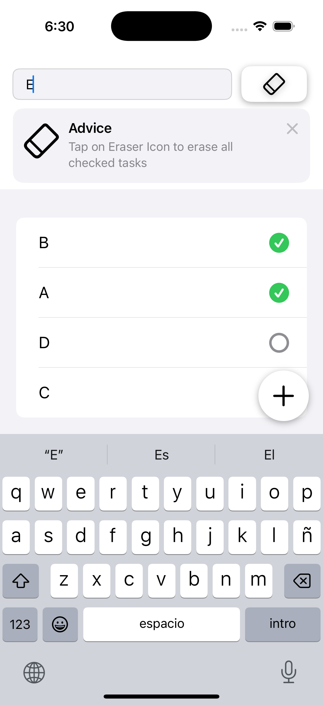
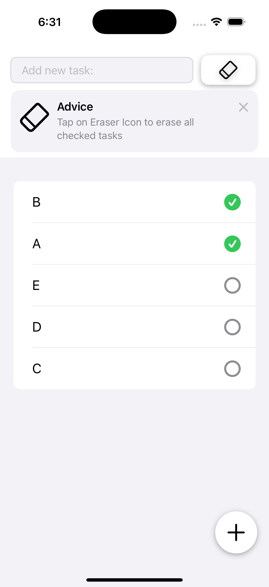
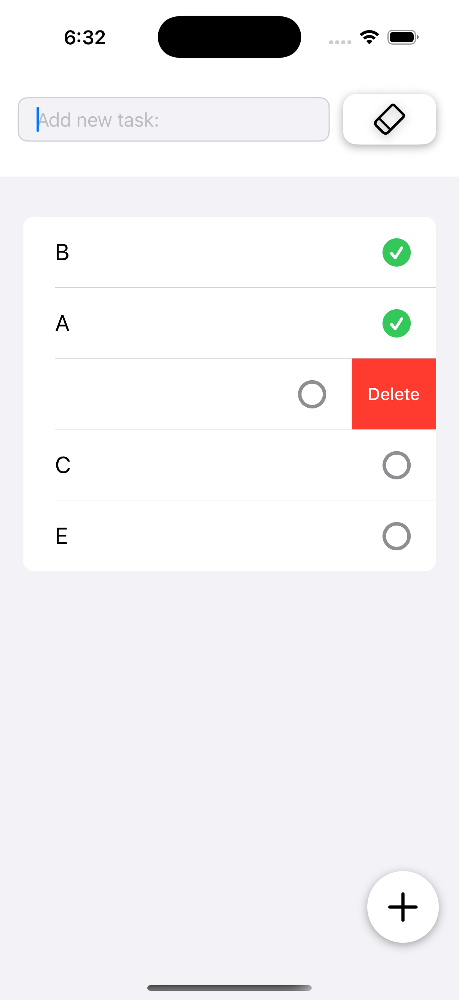
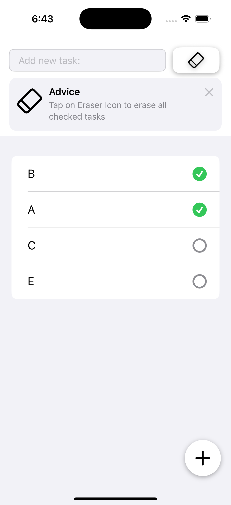
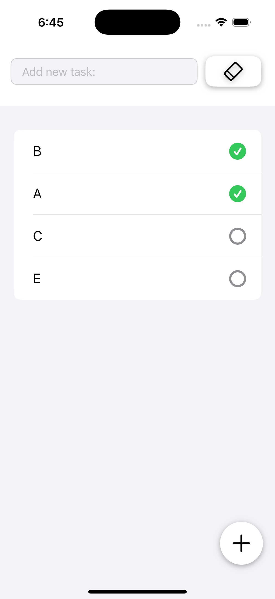
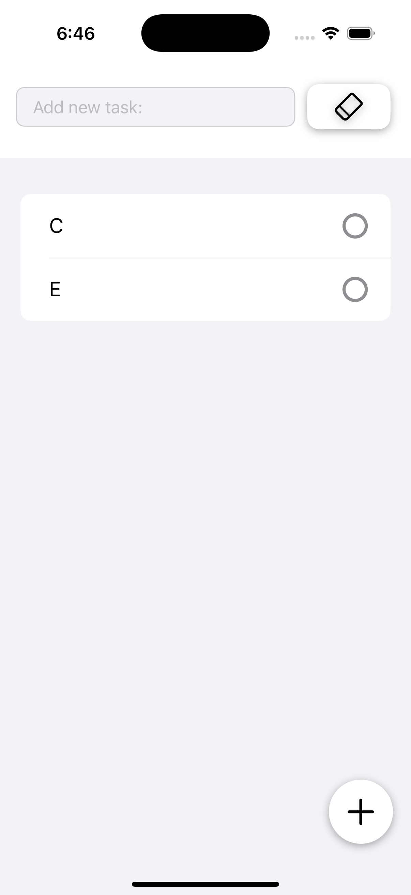
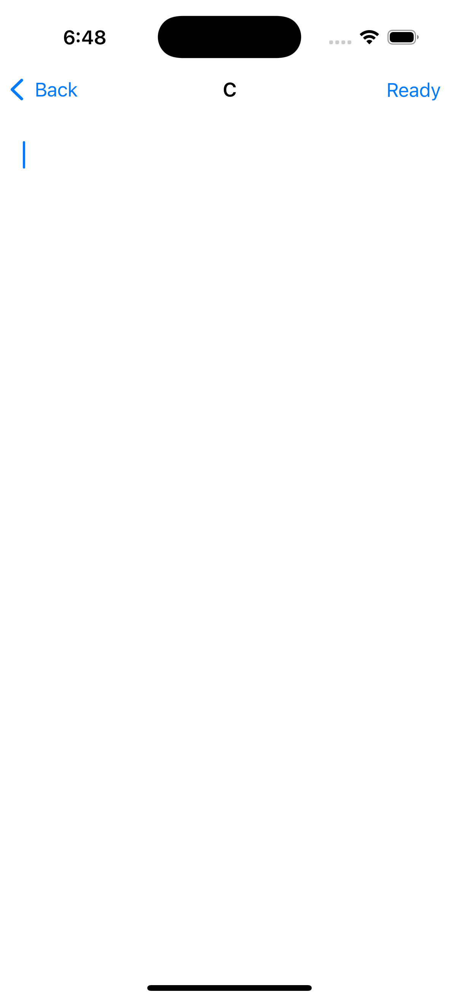
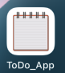

# Minimalist Tasks App

An iOS app that allows users to create, edit, and manage tasks with titles and optional descriptions. Tasks can be marked as completed, sorted, or deleted with ease.

## Technologies used:

- Swift
- SwiftUI
- SwiftData
- Combine
- TipKit

## Architecture & Concepts:

- `@Model`, `@Query`, and `@Bindable` for reactive model management
- `NavigationStack` for modern navigation flow
- `List`, `TextField`, and `TextEditor` for dynamic task interaction
- `@Environment(\.modelContext)` for data persistence using SwiftData
- Combine-based `KeyboardObserver` to detect keyboard visibility
- TipKit to provide contextual in-app guidance with action buttons

## Features:

- Add, edit, and delete tasks
- Toggle completion state with checkmark buttons
- Optional task description field
- Smart keyboard dismissal on tap
- Tasks sorted to show completed ones at the top
- Floating action button to add new tasks
- Inline TipKit hints for UI guidance
- Clean, minimalist interface optimized for productivity

  
  

  
    

  
    

  
    

  
    

